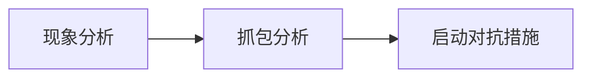

# 1.基本概念

* **拒绝服务** 是指应用系统无法正常对外提供服务的状态，如<u>网络阻塞</u>、<u>系统宕机</u>、<u>响应缓慢</u>等都属于拒绝服务的表现

* 拒绝服务攻击（Denial of Service Attack）是一种通过各种技术手段导致目标系统进入拒绝服务状态的攻击，常见手段包括利用漏洞、消耗应用系统性能和消耗应用系统带宽

* 分布式拒绝服务攻击（Distributed Denial of Service Attack）是拒绝服务攻击的高级手段，利用分布全球的僵尸网络发动攻击，能够产生大规模的拒绝服务攻击
  - DDOS攻击通常通过黑客控制的僵尸网络来实现
  - 肉鸡也称肉机或傀儡机，是指可以被黑客远程控制的机器，黑客入侵PC后可以通过后门程序控制目标主机，使其成为肉鸡
  -  C&C服务器，其全称为command and control server，通常是黑客用来控制肉鸡的服务器
  - 僵尸网络(英文名称叫BotNet),黑客使用C&C服务器控制了一批服务器
  - 在过去安全防护还不是很强的时代，引起DDOS攻击的主要动机大多为恶性竞争、敲诈勒索、黑客组织展现实力攻击根域名服务器...

# 2.攻击原理

## 2.1 攻击分类

DDOS攻击根据攻击手段的不同，可以分为漏洞型、业务型和流量型三类

防御难易程度：流量型<业务型<漏洞型

|                     攻击名称                     |                       攻击手段                        |  类型  |     协议     |
| :----------------------------------------------: | :---------------------------------------------------: | :----: | :----------: |
|   MS12-020攻击、死亡之PING、泪滴攻击、LAND攻击   |     制造系统错误导致大量消耗系统性能、重启或宕机      | 漏洞型 | TCP/UDP/ICMP |
|  TCP FLOOD（SYN FLOOD、ACK FLOOD、FIN FLOOD等）  |             消耗服务器性能、占用半连接表              | 业务型 |     TCP      |
|                 Connection Flood                 |              消耗服务器性能、占用连接数               | 业务型 |     TCP      |
| Http flood（HTTP GET FLOOD、HTTP  POST FLOOD等） | 消耗WEB服务器性能、消耗数据库服务器性能、消耗连接数等 | 业务型 |     TCP      |
|                    DNS  FLOOD                    |                    消耗服务器性能                     | 业务型 |     UDP      |
|             ICMP  FLOOD (Smurf攻击)              |                       阻塞带宽                        | 流量型 |     ICMP     |
|                    UDP  FLOOD                    |                       阻塞带宽                        | 流量型 |     UDP      |

说到拒绝服务攻击难免会提到一个关键词“流量大小”，在实际工作中，流量大小其实有两重含义：bps和pps。

- bps即bits per second，每秒发送的位数 \  bps=带宽

- pps即packets ，每秒发送的包数

若pps流量较大，可能在比设备可承受的最大bps流量小很多的情况下，达到阻塞网络的效果

致使DOS攻击生效的特征：

- 制造系统错误

- 消耗连接
- 带宽阻塞
- 想尽办法调戏服务器

## 2.2 TCP FLOOD

TCP协议是有连接的协议，协议在实现的过程中存在11种状态，根据接收到的数据包进行状态，这些状态的维持和转化需要消耗系统性能，同时为了保障系统正常运行，操作系统通常会对维持状态的数量进行限制

如果攻击者违背正常的TCP协议发包规律对大量发送异常的请求包，可能会导致TCP协议状态紊乱，消耗大量系统性能，或快速达到系统维持的状态上限，从而导致正常用户无法建立TCP连接

根据发送的攻击包不同，可以分为SYN FLOOD、ACK FLOOD、RST FLOOD、FIN FLOOD等，SYN FLOOD是最常见的TCP FLOOD类型

### 2.2.1 SYN Flood

伪造地址进行SYN请求(大量)，这种请求服务器是永远都等不到回应的，会耗尽服务器资源

攻击现象：

* 大量SYN_RECV状态（可通过netstat 看到）
* 半开连接数达到上限，无法建立新的连接
* CPU、内存占用率过高，系统卡顿、宕机

TCP半开连接是指发送或者接受了TCP连接请求,等待对方应答的状态,半开连接状态需要占用系统资源以等待对方应答，出于资源保护的目的，系统通常会对半开连接数进行限制

### 2.2.2 CC攻击-Connection Flood

> CC攻击（ChallengeCollapsar）是一种较新的攻击类型，其名字来源于著名安全厂商绿盟科技早年的抗拒绝服务设备“Collapsar（黑洞）”，由于此设备对早期的拒绝服务攻击和tcpflood等当时常见的攻击行为具有良好的防护能力，攻击者开发了被称之为“ChallengeCollapsar（挑战黑洞）”的新型攻击模式以绕过当时Collapsar设备的安全防护机制

传统拒绝服务攻击通常利用网络层或传输层协议的实现缺陷来进行攻击，攻击端不会与攻击目标建立完整的连接，甚至IP源地址大都是伪造的，这样的行为模式差异通过一些防护算法可以相对准确的识别出来从而对攻击进行防护。 而CC攻击主要针对应用层开展，攻击端会与服务端建立完整的连接，甚至可以模拟许多正常客户端的访问行为，因此攻击的识别难度大大增加，而且由于应用层消耗的系统资源通常远高于网络层，因此可以使用更小的流量达到更高的攻击效果。**CC攻击有直接攻击、通过代理服务器攻击和利用僵尸网络进行攻击三类**

Connection flood即连接耗尽攻击， TCP协议是有连接的协议，而维持TCP连接需要消耗服务器性能，出于资源保护的目的，系统通常会对TCP连接数进行限制

如果攻击者发送大量的TCP连接，会导致服务性能大量消耗或TCP连接数快速达到限制的上限，从而导致正常用户无法建立新的连接

攻击现象：

* 大量Establish 和FIN_WAIT状态（可通过netstat 看到）

* 连接数达到上限，无法建立新的连接
* CPU、内存占用率过高，系统卡顿、宕机

### 2.2.3 CC攻击-慢速攻击

慢速攻击是连接耗尽攻击的增强变种，由于操作系统和应用服务通常有最大等待时间设置（TCP连接建立后如果超过最大等待时间还没有数据交互，连接会自动断开），因此需要持续不断的消耗发起新的连接请求才能持续占用目标主机的连接数，而持续发起新的建立连接的请求会需要消耗攻击者较多的资源带宽和性能资源。

慢速攻击则利用了HTTP协议的特性，**在连接建立后以较慢的速率（如1S~10S内随机发送一个很小的数据包）**，使得服务端无法自动断开连接，从而持续占用服务器连接数实现拒绝服务攻击的目的。理想状态下一台普通PC即可维持3000个左右的连接数，这对服务器是非常致命的。使用较多的慢速攻击工具有：Slowhttptest和Slowloris

增强在哪？发起大量TCP连接的同时，进行少而慢刚刚好可以维持连接的数据交互，这一点利用HTTP协议最容易办到，比如：

- **Slow header** 发送HTTP头部请求，但是一直发，就是不发送2个连续的\r\n，导致服务器不断等待客户端继续发送数据
- **Slow body** 构造HTTP POST请求，该请求的Content-Length头部值很大，使得服务器以为你要发送很多数据，但是实际上你一次只发了一点点数据，服务器就在那继续等，不会轻易断开，要断了就继续重发请求
- **Slow read** 正常发送HTTP请求，但是在读取服务器响应response的时候很慢，致使服务器以为你很忙，不得不消耗资源不断询问你是否可以接受数据

### 2.2.4 CC攻击-Http flood

http flood是针对WEB应用的攻击。WEB应用中的**动态页面**需要WEB服务器发起数据库查询，此类查询通常需要消耗WEB服务器、数据库服务器大量的性能，同时，WEB服务器与数据库服务器之间的连接数也是有限的

如果攻击者发起大量的HTTP请求，访问需要数据库查询的动态页面，则有可能导致WEB服务器和数据库服务器性能大量消耗，或WEB服务器与数据库服务器之间的连接数耗尽，使用户无法正常访问WEB应用

攻击现象：

* WEB服务器CPU、内存过高导致宕机或卡顿

* 数据库服务CPU、内存过高导致宕机或卡顿

* 数据库服务器连接数过高，导致无法进行数据库查询。

### 2.2.5 DNS Flood

DNS flood是针对DNS服务的攻击。DNS服务器通常分为缓存服务器，用户的DNS请求如果在缓存服务上有记录，则直接从缓存服务器返回，否则交由递归服务器进行递归查询，将查询结果记录缓存服务器并返回用户

攻击者可以伪造大量DNS请求大量消耗缓存服务器性能导致拒绝服务

或者**随机伪造大量不存在的DNS记录，导致大量递归查询，使递归服务器拒绝服务**

通常递归服务器性能比缓存服务器性能低很多，因此，后一种攻击方式是更为有效的

攻击现象：

* 缓存服务器CPU、内存过高导致宕机或卡顿
* 递归服务器CPU、内存过高导致无法进行递归查询

## 2.3 流量型拒绝服务攻击

流量型拒绝服务攻击主要以消耗目标业务系统的带宽资源为攻击手段，通常会导致网络阻塞，从而影响正常业务

由于UDP/ICMP协议属于无连接协议，消耗的系统资源较少，相同条件下容易产生更高的流量，是流量型攻击的主要手段，由于ICMP协议报文被丢弃不影响大多数系统运行，容易被防护，因此，**UDP FLOOD成为了流量型拒绝服务攻击的主要手段**

攻击现象：

* 网络接口，尤其是出口设备的网络接口流量过大，被阻塞
* 用户访问卡顿、无响应

## 2.4 反射型拒绝服务攻击

流量型拒绝服务攻击的核心是流量的大小，流量越大造成的危害越大。但是受到肉鸡的上行带宽的限制，想要形成超高流量的拒绝服务攻击存在难度，于是攻击者就利用了遍布全球的互联网基础设施来对流量进行放大，利用较少的资源产生超大规模的攻击，最典型的包括DNS反射攻击和NTP反射攻击，此外，SSDP或SNMP等协议也可以作为反射型攻击

反射型拒绝服务攻击的产生条件：

​	1、采用UDP协议，可以伪造源

​	2、面向互联网提供服务，任何人都可以访问

​	3、开启了可被利用于放大流量的功能

NTP是Network Time Protocol（网络时间协议）的简称，是互联网中时间同步的标准之一，它的用途是把计算机的时钟同步到国际标准时间，连接在互联网上的机器通过该协议校准时间

NTP协议中Monlist指令可以获取与目标NTP Server进行过同步的最新600个客户机IP。**因此一个很小的请求包，就能获取到大量的由IP地址组成的连续UDP包**

MONLIST请求数据包通常为234字节，MONLIST响应数据包会分割成482字节的数据包，每个数据包包含6个IP，即理论上放大值为482*100/234=206倍

# 3.流量分析

**IP分析 -> 协议分析 -> 特征分析**   使用工具按照这个思路分析(wireshark基础使用)

特征分析需要灵活使用关系运算符，可以很好的做筛选

| 关系运算符 |      说明      |
| :--------: | :------------: |
| Is present |    字段存在    |
|     ==     |      等于      |
|    ！=     |     不等于     |
|     >      |      大于      |
|     <      |      小于      |
|     >=     |     大等于     |
|     <=     |     小等于     |
|  contains  |      包含      |
|   match    | 匹配正则表达式 |

常见的抓包方式：

- 可以**在服务器上安装抓包工具**进行抓包，如linux的tcpdump，windows的wireshark都可以用于抓包。但考虑到拒绝服务攻击发生时服务器往往处于高负荷中，因此此种方式通常仅在技术研究时使用
- **通过流量镜像抓包**是常见的抓包方式，通常将交换机的流量镜像到某个端口，再通过接入PC上的抓包软件进行抓包
- 许多网络设备和安全设备自身已经提供了抓包功能，可以通过设备的管理界面直接进行抓包和下载抓包文件

# 4.拒绝服务攻击的处置

## 4.1 处置流程

拒绝服务攻击的处置流程从技术维度大致可以分为**现象分析**、**抓包分析**和**策略调整**三大维度，首先根据发现的现象、网络设备和服务的情况初步判断是否存在拒绝服务攻击，再通过抓包分析的方式进一步了解攻击的方式和特征，最后启动对抗措施进行攻击对抗

现象分析：使用现象、网络设备分析、服务器分析

抓包分析：IP分析、协议分析、特征分析

启动对抗措施：资源提升、安全加固、安全防护

## 4.2 对抗拒绝服务攻击的方法概述

对抗拒绝服务攻击的方法大致可以分为系统加固、提升资源、本地防护设备防护、互联网资源防护三类，实
际应用中会根据业务系统的安全性要求和可投入的资源综合选择多种防护方式进行对抗

- 提升资源，提升业务系统的带宽和性能资源能够有效对抗拒绝服务攻击，但性价比相对较低

- 安全加固，通过**补丁加固**和**安全配置**可以应对漏洞型拒绝服务攻击，但对大规模拒绝服务攻击的效果有限

  * 补丁加固是对抗漏洞型拒绝服务最有效的方式，通过补丁修复系统存在的安全问题，可以使攻击无效化
  * 配置加固主要是针对业务型拒绝服务攻击，通过一些安全配置降低攻击的效果，如针对连接耗尽攻击，可以降低配置最大超时时间和最大等待时间来降低攻击影响，apache等中间件甚至有针对POST请求头部等待时间、HTTP单个请求和响应时间等针对慢速攻击的配置

- 安全防护分两类：

  * 本地设备防护：通常**防火墙、入侵防护系统、WEB应用防火墙和专用的抗拒绝服务设备**都可以进行拒绝服务攻击防护。本地防护设备适用于攻击流量较小的情况，一旦攻击流量超过业务系统的出口带宽，本地防护设备将无法有效防护

  * 互联网资源防护：利用电信运营商、云服务商、CDN服务商等服务商的互联网资源**将流量进行分流防护后再导入本地**，即最终是通过DNS解析等手段将攻击流量牵引到其防护资源节点，将清洗后的流量发送到目标网络，由本地防护设备进行进一步过滤后到达最终的服务。
  * 这种方式可以应对大规模的攻击流量，但防护效果依赖第三方服务的可靠性，用户可控性较差
  * 通常是结合使用互联网资源防护和本地设备防护

## 4.3 拒绝服务攻击防护机制

拒绝服务攻击防护主要包括特征匹配、交互验证、人机识别三类，在实际应用中，这些防护机制会被综合使用

### 4.3.1 特征匹配

特征匹配主要包括**数据包特征**和**统计学特征**的匹配，数据包特征包括IP、端口、协议、标志位、载荷等，统计学特征以bps和pps为主，对符合攻击特征的数据包进行过滤

#### 数据包特征匹配

特征匹配基于黑名单机制，匹配到攻击特征就丢弃相应的数据包，通常安全防护设备会有通用的特征黑名单，攻击处置时安全工作者可以根据业务自身特征和攻击类型特点配置防护规则

基于IP特征

- IP协议合法性检查，如源地址为私网地址、源地址与目的地址一致等不符合IP协议的特征

- IP来源，如对于仅为国内客户的提供服务的网站而言，可以把来源为国外的IP地址视为一种可疑的攻击特征

基于协议特征

- 协议合法性检查，如SYN-64（缺失必要字段的SYN包）、SYN+RST标志的TCP包、畸形分片包等

- 某些攻击依赖特定协议，如果正常业务中不需要这些协议，则可以视为可疑的攻击特征，如NTP协议、ICMP协议等

基于包长度

- 某些业务的包长有正常的范围，如DNS请求包通常在100字节以内，因此200字节以上的包长可以视为可疑的攻击特征

- 为了增加bps流量，攻击者通常会填充一些无效载荷使得包长变长，此时如果没有做随机化处理可能所有攻击包的包长都一致，此时特定包长可以作为攻击特征。

基于内容特征

- 为了增加bps流量，攻击者通常会填充一些无效载荷此时如果没有做随机化处理可能所有攻击包的载荷都一致或具有相同特点，可以作为攻击特征。

- 一些应用层数据，如DNS请求的域名、HTTP的请求URL等，也可能具备攻击特征

#### 统计学特征匹配

基于统计学的特征匹配主要是统计bps和pps，分为固定基线和动态基线两类，固定基线即固定的值，超过这个值认为存在攻击，动态基线在固定基线的基础上结合上时间元素，即通过流量学习的方式生成基于时间的基线，每个时间段的基线不同

统计的维度通常以每个源IP为单位进行统计，也可以继续细分，以IP+端口，或IP+协议等维度进行统计

基于统计学特征的匹配方式误报率相对于基于数据包的特征的匹配方式要高一些，因此基于统计学的特征匹配方式通常为最后的使用手段，或者作为开启交互验证、人机识别算法的前置条件

### 4.3.2 交互验证

交互验证通常在专用的拒绝服务攻击防护设备上使用，通过专门的算法模拟服务器行为与客户端进行交互，**根据客户端的反应判断客户端是真实的客户端还是攻击工具**，从而对攻击行为进行过滤

交互验证算法对伪造源IP的攻击行为和简单的攻击工具（只发包，不对服务端响应做处理）有明显防护的效果，**但如果攻击者采用的是真实源IP（肉鸡或代理服务器的模式）且攻击工具可以正常处理服务器请求**，**交互验证模式难以起到有效防护**

SYN FLOOD防护、DNS flood防护、HTTP Flood防护 这些需要建立连接的服务都支持使用交互验证防护攻击

交互验证算法本质是与击工具进行对抗，攻击工具的实现越接近正常客户端，则交互识别的难度越大，如果攻击工具能完全模拟正常客户端的交互模式，则交互验证算法就无法生效

### 4.3.3 人机识别

人机识别是目前最有效的攻击防护机制之一，图片验证码是常见的人机识别方式之一，当怀疑某个请求可能是机器发起时可要求客户端进行人机验证，验证通过后方能继续访问。人机识别操作对用户体验的影响比较大，通常在传统防护机制不起效时使用